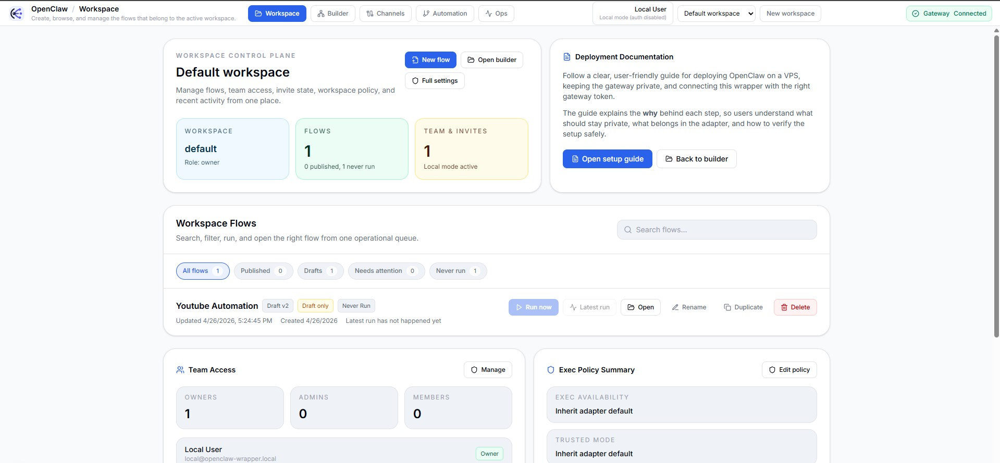
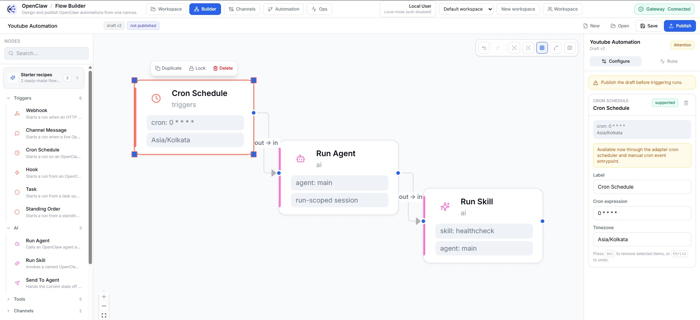

<div align="center">

# OpenClaw Wrapper

**A visual control plane for OpenClaw automations**

Design flows, manage channels, inspect runs, review approvals, and operate automations — all from a local-first workspace.

[](https://github.com/shamuddin/openclaw-wrapper/actions/workflows/ci.yml)
[](LICENSE)
[](package.json)
[](https://pnpm.io/)
[](https://www.typescriptlang.org/)

[Getting Started](#-quick-start) · [Architecture](#-architecture) · [Contributing](CONTRIBUTING.md) · [Issues](https://github.com/shamuddin/openclaw-wrapper/issues)

</div>

---

> **Note** — This repository is the **wrapper layer**, not the OpenClaw runtime itself.
> OpenClaw remains the execution substrate and capability provider. This project adds the builder, persistence, workspace APIs, orchestration records, and operator-facing surfaces around it.

## Screenshots

<table>
  <tr>
    <td align="center"><strong>Workspace Dashboard</strong></td>
    <td align="center"><strong>Flow Builder</strong></td>
  </tr>
  <tr>
    <td></td>
    <td></td>
  </tr>
</table>

## Highlights

| | Feature | Description |
|---|---------|-------------|
| **Canvas** | Visual flow builder | React Flow canvas with node palette, config panels, publish, and run inspection |
| **Durable** | Control plane | Flows, versions, runs, approvals, workspace state, automation ledgers, and memory records |
| **Operator** | Multi-surface UI | Channels, automation, and ops views — the canvas isn't the whole product |
| **OSS** | Local-first mode | `AUTH_MODE=disabled` so contributors can run the app with zero sign-in friction |
| **Typed** | Shared schemas | TypeBox contracts across web and adapter keep builder and runtime aligned |
| **Extensible** | Plugin architecture | Node SDK, manifest-based extensions, and catalog-driven node metadata |

## What's Inside

OpenClaw Wrapper is a **three-tier TypeScript monorepo**:

```
                 ┌──────────────────┐
                 │   apps/web       │  Next.js 15 · React 19 · React Flow
                 │   :3000          │  Workspace UI, builder, channels, ops
                 └────────┬─────────┘
                          │ tRPC
                 ┌────────▼─────────┐
                 │   apps/adapter   │  Fastify · tRPC · Drizzle · BullMQ
                 │   :4000          │  DB, runs, approvals, memory, triggers
                 └────────┬─────────┘
                          │ WebSocket
                 ┌────────▼─────────┐
                 │  OpenClaw Gateway │  External runtime · agents · skills
                 │   :18789         │  (not included — runs separately)
                 └──────────────────┘
```

### Main Surfaces

| Surface | What it does |
|---------|-------------|
| **Builder** | Design, save, publish, and inspect automation flows |
| **Channels** | Manage wrapper-owned channel profiles (WhatsApp, Telegram, Slack, Discord) and view runtime state |
| **Automation** | Review task-flow progression, retries, children, and managed automation history |
| **Ops** | Gateway status, runtime inventory, approvals, activity, plugin diagnostics, and health signals |

## Quick Start

### Prerequisites

- **Node** `22.16.0+`
- **pnpm** via Corepack
- **Docker** for local Postgres + Redis
- A running **OpenClaw gateway**

### Setup

```bash
# Enable pnpm through Corepack
corepack enable

# Install dependencies
pnpm install

# Copy environment templates
cp apps/adapter/.env.example apps/adapter/.env
cp apps/web/.env.example     apps/web/.env.local

# Start local infrastructure (Postgres + Redis)
pnpm infra:up

# Apply database migrations
pnpm db:migrate

# Start the dev servers
pnpm dev
```

> Make sure the OpenClaw gateway is running on `ws://127.0.0.1:18789` before starting, or update `GATEWAY_WS_URL` in `apps/adapter/.env`.

Open **http://localhost:3000** — in local mode, the app drops you straight into the workspace.

### Default Ports

| Service | Port |
|---------|------|
| Web | `3000` |
| Adapter | `4000` |
| Postgres | `55433` |
| Redis | `56379` |
| Gateway WS | `18789` |

## Auth Modes

| Mode | Use case | Behaviour |
|------|----------|-----------|
| `AUTH_MODE=disabled` | Local dev, OSS, single-user | Auto-creates a local owner, opens straight into workspace |
| `AUTH_MODE=required` | Team / hosted deployments | Sign-in, sessions, invites, and multi-user controls enabled |

The adapter defaults to `disabled` unless `NODE_ENV=production`.

## Architecture

```text
apps/
  web/              Next.js workspace UI
  adapter/          Fastify + tRPC + Drizzle + BullMQ runtime layer
packages/
  schemas/          Shared TypeBox wire schemas
  memory-sdk/       Shared memory query + status helpers
  openclaw-client/  WebSocket client wrapper with reconnect/backoff
  node-sdk/         External plugin and node contract surface
  tsconfig/         Shared tsconfig presets
infra/
  docker-compose.yml
```

| Layer | Responsibility |
|-------|---------------|
| **Web** | Renders workspace surfaces, talks only to the adapter, manages builder UI and operator workflows |
| **Adapter** | Owns database, tRPC APIs, trigger endpoints, flow execution, waits/resume, gateway connection |
| **Gateway** | Provides upstream runtime, agents, skills, and channel capabilities (external dependency) |

## Scripts

| Command | Description |
|---------|-------------|
| `pnpm dev` | Run adapter + web in parallel |
| `pnpm build` | Build the full workspace |
| `pnpm test` | Run Vitest across packages |
| `pnpm typecheck` | TypeScript checks across the monorepo |
| `pnpm lint` | Biome lint + format check |
| `pnpm infra:up` | Start local Postgres and Redis |
| `pnpm infra:down` | Stop local Postgres and Redis |
| `pnpm db:migrate` | Apply checked-in adapter migrations |
| `pnpm db:generate` | Generate a new migration after schema changes |
| `pnpm db:push` | Push schema changes directly to a local database |

## Current Boundaries

- The wrapper depends on an external OpenClaw gateway
- Some pairing and operational paths are still partial
- Published flow execution does not support cycles yet
- Browser and tool support is intentionally narrower than full browser automation
- Plugin management is stronger on discovery and diagnostics than on operator controls

## Development Notes

- Keep shared contracts aligned through `packages/schemas`
- Treat runtime, workspace, and canvas concepts as distinct on purpose
- Prefer durable records over transient in-memory orchestration
- Keep new wrapper features conceptually close to upstream OpenClaw where possible

## Docs

| Document | Description |
|----------|-------------|
| [Configuration & Security](docs/configuration-and-security.md) | Env vars, deployment settings, secret handling |
| [Database Workflow](docs/database-workflow.md) | Migrations, schema changes, Drizzle workflow |
| [Local Mode Guide](docs/open-source-local-mode.md) | Running the wrapper in OSS / local-first mode |
| [Plugin Development](docs/plugin-development.md) | Authoring extensions and validating manifests |
| [End-to-End Guide](docs/end-to-end-project-guide.md) | Full product and technical walkthrough |
| [Contributing Guide](docs/contributing.md) | Architecture guidance for contributors |
| [Release Process](docs/release-process.md) | Changelog and release-note expectations |

## Governance

[Contributing](CONTRIBUTING.md) · [Code of Conduct](CODE_OF_CONDUCT.md) · [Security](SECURITY.md) · [Changelog](CHANGELOG.md)

## License

[MIT](LICENSE) &copy; OpenClaw Wrapper contributors
